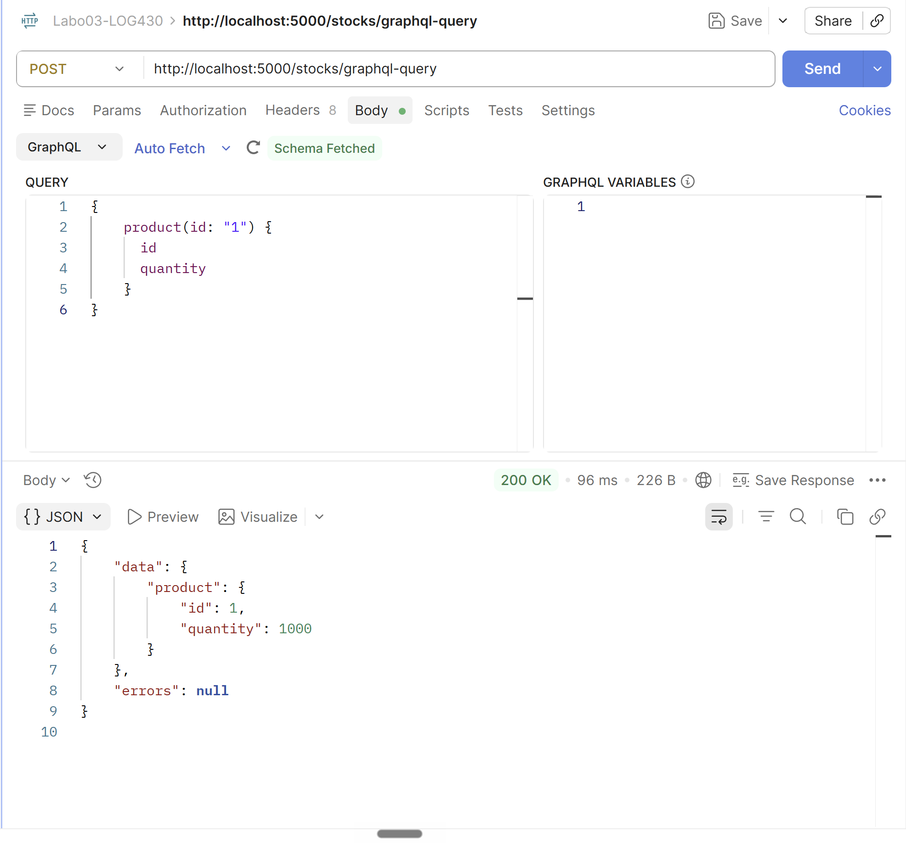
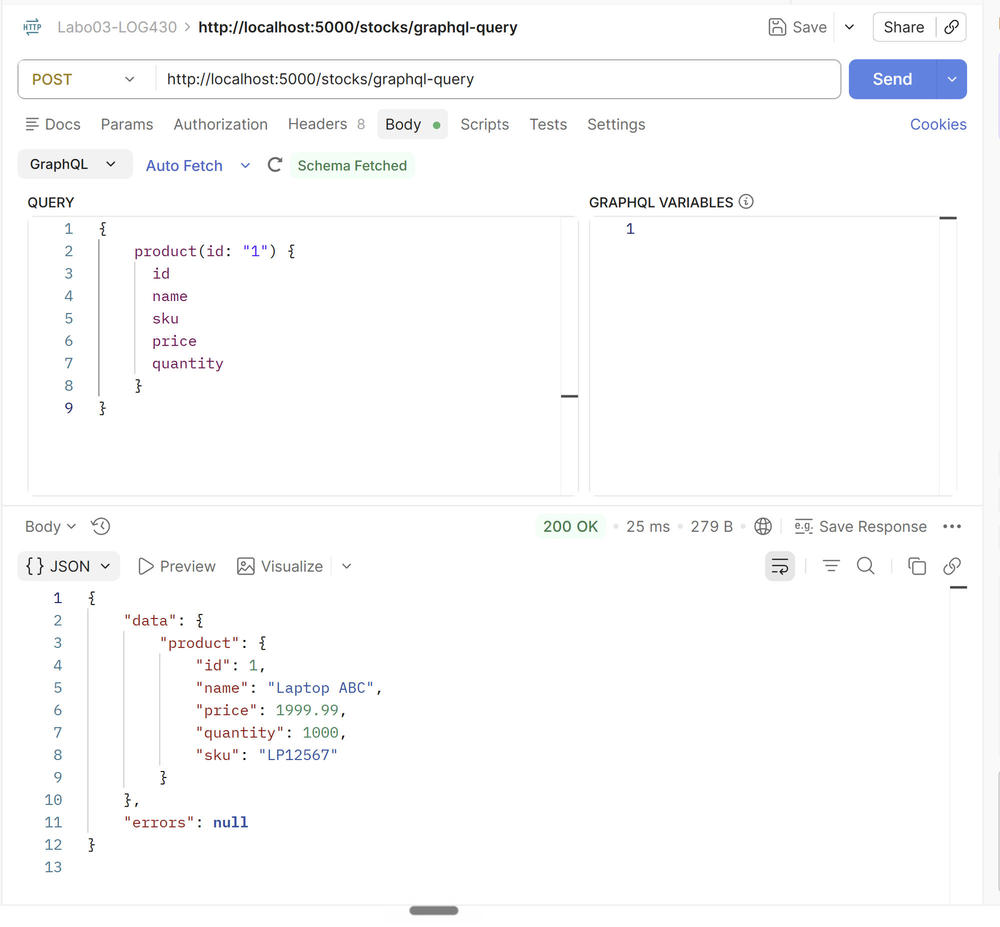

# Rapport — Laboratoire 3 : API REST et GraphQL

LOG430-02 — Architecture logicielle, École de technologie supérieure (ÉTS)
Chargé de laboratoire : Gabriel C. Ullmann

Ralph Christian Gabriel
Code permanent : GABR77340401
Session : Été 2026

---

## Introduction

Dans ce laboratoire, on reprend l'application de gestion de magasin des labos précédents et on la fait passer d'un monolithe à une API Flask. Le code est maintenant séparé en deux domaines, les commandes (`orders`) et les stocks (`stocks`), et on ajoute par-dessus la gestion du stock des articles. MySQL conserve les données, Redis sert de cache pour les stocks, et le tout tourne dans des conteneurs Docker.

J'ai validé chaque activité en exécutant réellement le code plutôt qu'en me fiant à ce qui devrait marcher : le test d'intégration dans le conteneur, les appels REST et GraphQL, et le conteneur fournisseur. Les sorties reproduites ici viennent de ces exécutions.

---

## Activité 1 — Diagramme ER et table stocks

La table `stocks` n'existait pas au départ. Je l'ai créée dans MySQL Workbench, puis appliquée à la base avec Forward Engineering. Je l'ai aussi ajoutée à `db-init/init.sql` pour que le conteneur MySQL la recrée automatiquement à son premier démarrage :

```sql
CREATE TABLE stocks (
    product_id INT PRIMARY KEY,
    quantity INT NOT NULL DEFAULT 0,
    FOREIGN KEY (product_id) REFERENCES products(id) ON DELETE RESTRICT
);
```

La colonne `product_id` est à la fois la clé primaire et une clé étrangère vers `products.id`. Concrètement, on ne peut ajouter du stock que pour un produit qui existe déjà, et le `ON DELETE RESTRICT` empêche de supprimer un produit tant qu'une ligne de stock le référence.

Le fichier `.mwb` joint contient le modèle ER complet : users, products, orders, order_items et stocks.

---

## Activité 2 — Test du processus de stock

Le test `test_stock_flow()` (dans `src/tests/test_store_manager.py`) suit les six étapes demandées :

| # | Action | Endpoint | Vérification |
|---|--------|----------|--------------|
| 1 | Créer un article | `POST /products` | 201, `product_id > 0` |
| 2 | Ajouter 5 unités | `POST /stocks` | 201 |
| 3 | Vérifier le stock | `GET /stocks/:id` | `quantity == 5` |
| 4 | Commander 2 unités | `POST /orders` | 201, `order_id > 0` |
| 5 | Vérifier le stock | `GET /stocks/:id` | `quantity == 3` |
| 6 | Supprimer la commande (étape extra) | `DELETE /orders/:id` | 200, le stock remonte à 5 |

En lançant `pytest` dans le conteneur, les deux tests passent :

```
tests/test_store_manager.py::test_health PASSED       [ 50%]
tests/test_store_manager.py::test_stock_flow PASSED   [100%]
============================== 2 passed in 2.54s ==============================
```

### Question 1 — Méthodes HTTP sûres et idempotentes (RFC 7231, §4.2.1 et 4.2.2)

La RFC 7231 définit deux propriétés. Une méthode est sûre (§4.2.1) si elle ne modifie pas l'état du serveur, c'est-à-dire si elle se contente de lire. Elle est idempotente (§4.2.2) si l'exécuter plusieurs fois laisse le serveur dans le même état qu'un seul appel.

Pour les méthodes utilisées à l'activité 2 :

| Méthode | Endpoints (activité 2) | Sûre | Idempotente |
|---------|------------------------|------|-------------|
| GET | `GET /stocks/:id` | Oui | Oui |
| POST | `POST /products`, `POST /stocks`, `POST /orders` | Non | Non |
| DELETE | `DELETE /orders/:id` | Non | Oui |

Le `GET` se contente de lire le stock : il est donc sûr et idempotent. Le `POST` n'est ni l'un ni l'autre, parce que chaque appel crée une ressource : deux `POST /orders` identiques produisent deux commandes distinctes et décrémentent le stock deux fois. Le `DELETE` modifie l'état, donc il n'est pas sûr, mais il reste idempotent : supprimer la commande #5 une fois ou dix fois mène au même résultat final (la commande n'existe plus), les appels suivants renvoyant simplement un 404.

Un cas mérite une nuance. `POST /stocks` fait un `UPDATE ... SET quantity = :qty`, une affectation absolue, donc en pratique le répéter ne change rien après le premier appel. Du point de vue de la RFC, `POST` reste malgré tout classé comme non idempotent, car la sémantique de la méthode n'offre aucune garantie d'idempotence au client.

---

## Activité 3 — Rapport de stock avec une jointure SQLAlchemy

La méthode `get_stock_for_all_products()` (`src/stocks/queries/read_stock.py`) ne renvoyait au départ que le `product_id` et la quantité. J'y ai ajouté `name`, `sku` et `price` en joignant `Stock` à `Product`.

### Question 2 — Utilisation de la méthode join

Il n'y a pas de `relationship` ORM déclarée entre `Stock` et `Product`, donc je ne pouvais pas utiliser la forme « Simple Relationship Join » où l'on écrit juste `join(Product)`. J'ai donc pris la forme « Joins to a Target with an ON Clause », qui prend la cible et la condition de jointure en arguments : `join(Product, Stock.product_id == Product.id)`.

```python
def get_stock_for_all_products():
    """Get stock quantity for all products (avec un JOIN vers Product)"""
    session = get_sqlalchemy_session()
    results = session.query(
        Stock.product_id,
        Stock.quantity,
        Product.name,
        Product.sku,
        Product.price,
    ).join(Product, Stock.product_id == Product.id).all()
    stock_data = []
    for row in results:
        stock_data.append({
            'Article': row.name,
            'Numero SKU': row.sku,
            'Prix unitaire': float(row.price),
            'Unites en stock': int(row.quantity),
        })
    return stock_data
```

SQLAlchemy traduit cet appel en :

```sql
SELECT stocks.product_id, stocks.quantity, products.name, products.sku, products.price
FROM stocks JOIN products ON stocks.product_id = products.id;
```

L'endpoint `GET /stocks/reports/overview-stocks` renvoie alors le détail de chaque article :

```json
[
  { "Article": "Laptop ABC",         "Numero SKU": "LP12567", "Prix unitaire": 1999.99, "Unites en stock": 1000 },
  { "Article": "Keyboard DEF",       "Numero SKU": "KB67890", "Prix unitaire": 59.5,    "Unites en stock": 500 },
  { "Article": "Gadget XYZ",         "Numero SKU": "GG12345", "Prix unitaire": 5.75,    "Unites en stock": 2 },
  { "Article": "27-inch Screen WYZ", "Numero SKU": "SC27289", "Prix unitaire": 299.75,  "Unites en stock": 90 }
]
```

---

## Activité 4 — Utilisation de l'endpoint GraphQL

L'endpoint `POST /stocks/graphql-query` laisse le client demander exactement les champs qu'il veut, sans qu'on ait à créer un nouvel endpoint REST par combinaison de colonnes.

### Question 3 — Résultat initial

Au départ, le résolveur `resolve_product` ne lisait que la quantité dans Redis, et le type GraphQL `Product` n'exposait que `id`, `name` et `quantity`. La requête suggérée dans l'énoncé :

```graphql
{ product(id: "1") { id quantity } }
```

renvoyait donc bien `id` et `quantity`. Par contre, en demandant `name`, on récupérait la valeur codée en dur `"Product 1"`, et `sku` ou `price` n'existaient même pas dans le schéma (erreur « Cannot query field »). Les vraies informations de l'article n'étaient pas accessibles par GraphQL.



*Figure 1 — Réponse de `POST /stocks/graphql-query` dans Postman pour la requête `{ product(id: "1") { id quantity } }`.*

---

## Activité 5 — Enrichissement de l'endpoint GraphQL

J'ai fait trois changements : ajouter `sku` et `price` au type GraphQL `Product`, lire `name`, `sku` et `price` depuis Redis dans `resolve_product`, et surtout écrire ces champs dans Redis au moment où le stock change.

### Question 4 — Lignes modifiées dans update_stock_redis

Avant, la fonction se contentait d'écrire la quantité : `pipeline.hset(f"stock:{product_id}", "quantity", new_quantity)`. J'ouvre maintenant une session SQLAlchemy pour aller chercher l'article, je construis un `mapping` qui contient aussi `name`, `sku` et `price`, et j'écris le tout d'un coup :

```python
# Ajout d'information sur l'article (name, sku, price) dans Redis
mapping = {"quantity": new_quantity}
product = session.query(Product).filter(Product.id == product_id).first()
if product:
    mapping["name"]  = product.name
    mapping["sku"]   = product.sku
    mapping["price"] = float(product.price)

pipeline.hset(f"stock:{product_id}", mapping=mapping)
```

Par rapport à la version d'origine, j'ai ajouté l'import du modèle `Product` en haut du fichier, l'ouverture d'une session (fermée dans un `finally`), la requête `session.query(Product).filter(Product.id == product_id).first()`, la construction du `mapping` à quatre champs, et le passage à `hset(..., mapping=mapping)` au lieu d'un champ unique. La même logique a été reportée dans `set_stock_for_product`, qui est le chemin emprunté par `POST /stocks`.

### Question 5 — Résultat après les améliorations

La requête enrichie :

```graphql
{ product(id: "1") { id name sku price quantity } }
```

renvoie maintenant tous les champs depuis Redis :

```json
{
  "data": {
    "product": {
      "id": 1,
      "name": "Laptop ABC",
      "sku": "LP12567",
      "price": 1999.99,
      "quantity": 1000
    }
  },
  "errors": null
}
```

Le client choisit lui-même les colonnes (`name`, `sku`, `price`, `quantity`) sans qu'on ait eu à toucher à la signature de l'endpoint.



*Figure 2 — Réponse de `POST /stocks/graphql-query` dans Postman pour la requête enrichie `{ product(id: "1") { id name sku price quantity } }`.*

---

## Activité 6 — Communication entre conteneurs

Le script `scripts/supplier_app.py` joue le rôle d'une application fournisseur qui interroge l'endpoint GraphQL depuis un conteneur séparé. J'ai étendu son `TEST_PAYLOAD` pour qu'il demande aussi `sku` et `price` :

```python
TEST_PAYLOAD = "{\"query\":\"{\\n  product(id: \\\"1\\\") {\\n    id\\n    name\\n    sku\\n    price\\n    quantity\\n  }\\n}\\n\",\"variables\":{}}"
```

En lançant `docker compose -f scripts/docker-compose.yml up --build`, le conteneur fournisseur rejoint le réseau `labo03-network` et atteint l'API par son nom de service `store_manager` :

```
INFO - Calling http://store_manager:5000/stocks/graphql-query (attempt 1/3)
INFO - Response: 200 - OK
INFO - Response body: {"data":{"product":{"id":1,"name":"Laptop ABC","price":1999.99,"quantity":1000,"sku":"LP12567"}},"errors":null}
```

Le fournisseur reçoit bien `name`, `sku` et `price`. Pour que ça marche depuis un conteneur, j'ai rendu `ENDPOINT_URL` configurable : il vaut `localhost` par défaut (utile quand on exécute le script sur l'hôte), et il est surchargé vers `http://store_manager:5000/...` dans `scripts/docker-compose.yml`, de façon à passer par le DNS du réseau Docker.

### Question 6 — Mécanisme de communication

Le `docker-compose.yml` de la racine et celui de `scripts/` déclarent tous les deux le même réseau externe `labo03-network` :

```yaml
networks:
  labo03-network:
    driver: bridge
    external: true
```

C'est leur point commun. Comme les deux stacks rejoignent ce réseau bridge défini par l'utilisateur, Docker fournit un DNS interne qui résout chaque conteneur par son nom de service. Le conteneur `supplier_app` peut donc joindre l'API avec l'adresse suivante, sans jamais connaître son IP :

```
http://store_manager:5000/stocks/graphql-query
```

Les conteneurs communiquent ainsi comme s'ils partageaient un réseau local, tout en restant isolés du reste de la machine. Je l'ai vérifié depuis le conteneur `store_manager` : `getent hosts mysql` répond `172.21.0.3 mysql`.

---

## Intégration CI/CD et conteneurisation

Le pipeline `.github/workflows/ci.yml` rejoue les tests à chaque `push` et chaque `pull_request`. Il démarre des services MySQL 8.4.7 et Redis 7 avec leurs health-checks, installe Python 3.11 et les dépendances, génère le fichier `.env` (au passage, j'ai corrigé le bug du gabarit qui écrivait `DB_PASS` au lieu de `DB_PASSWORD`), initialise la base avec `db-init/init.sql`, puis lance `python -m pytest tests/ -v`. Le gabarit se contentait d'un `echo` à la place de la commande de test.

En local, le même résultat s'obtient avec `docker network create labo03-network` suivi de `docker compose up -d`, ce qui démarre les trois services (`store_manager`, `mysql`, `redis`). Une fois qu'ils sont healthy, le test tourne avec `docker compose exec store_manager python -m pytest tests/ -v`.

---

## Conclusion

Les six activités sont implémentées et vérifiées en exécutant réellement le code : test d'intégration au vert, rapport de stock avec jointure, endpoint GraphQL qui renvoie `name`, `sku` et `price`, communication entre conteneurs par nom de service, et pipeline CI/CD fonctionnel. L'application reste une API REST classique (interface uniforme, sans état, séparation client–serveur), à laquelle GraphQL ajoute la souplesse de laisser le client choisir les champs qu'il veut récupérer.
